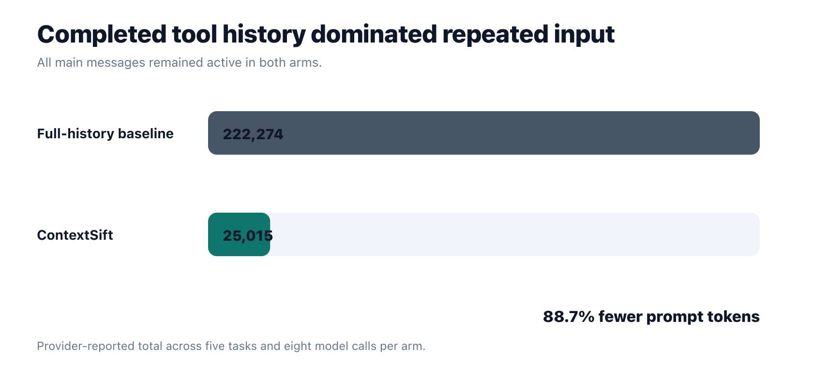
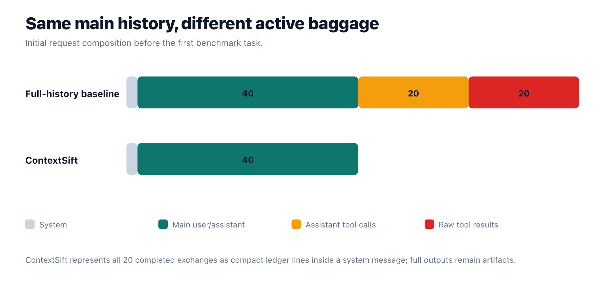
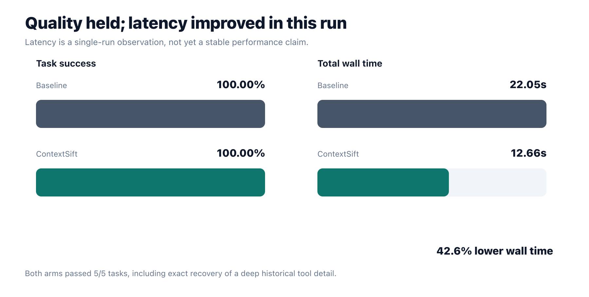

# We Cut an Agent’s Prompt Tokens by 88.7% Without Dropping a Single User Message

## The real ContextSift experiment: stop resending completed tool calls, but keep the whole conversation

The useful benchmark is not an arbitrary message-window comparison. A fixed window is guaranteed to look efficient once the transcript becomes long enough, but that was not the reason I built ContextSift.

The original question was more specific:

> Why does an agent keep resending completed tool calls and their raw results after the model has already consumed them?

So I discarded the message-window headline and ran the comparison that actually matters.

Both agents would keep **every main user message and every completed assistant response**. One would also keep every historical tool call and raw tool result in active context. ContextSift would externalize those completed exchanges, retain compact receipts, and preserve full results as retrievable artifacts.

No message-window shortcut. All main messages remained in both arms.

## Why frameworks retain completed tool calls

During an active tool loop, the model needs the complete sequence:

1. The user asks for something.
2. The assistant requests a tool.
3. The tool returns a result.
4. The model reads that result and decides what to do next.

Removing a tool result before step four would break the protocol. The model must see the result it requested.

The problem happens after the turn is complete.

Many agent implementations use a single growing message array. Appending the assistant tool call and tool response is correct during the turn, so the simplest implementation leaves them there forever. On the next user request, the whole array is sent again. Then again. Then again.

That preserves causality, but it treats a completed 70 KB terminal output as if it were still part of the agent’s immediate working memory.

The model may only need three facts afterward:

- the tool was called;
- it succeeded or failed;
- the full evidence can be recovered if needed.

The raw output does not need to ride inside every future prompt.

## What ContextSift keeps

ContextSift separates an **active working context** from a **lossless external record**.

It keeps all main conversation messages when configured with:

```toml
[context]
recent_main_messages = 0
```

Here, `0` means all main user and assistant messages.

For tools, the lifecycle is different:

- The current unfinished tool sequence remains fully active.
- Once the model consumes the result and completes the turn, the raw exchange leaves future prompts.
- A compact receipt remains in a tool ledger.
- Large output remains in an artifact store.
- The agent can use `artifact_read` or `artifact_search` to recover exact evidence.

A receipt looks conceptually like this:

```text
call-019 terminal_run → diagnostics completed [artifact-073]
```

That line preserves awareness without carrying thousands of log lines.

ContextSift also keeps an append-only conversation log and a separate tool-call log. Removing content from active context is not deleting history.

## The corrected benchmark

I created a controlled tool-heavy history containing:

- **40 main messages**: 20 user requests and 20 completed assistant responses;
- **20 completed tool calls**;
- **20 raw tool results**;
- **70,763 bytes** of historical tool output;
- approximately 4 KB of diagnostic output per historical call.

The two arms were:

### Full-history baseline

The baseline kept all 40 main messages, all 20 assistant tool-call messages, and all 20 raw tool-result messages. New tool exchanges produced during the benchmark also remained in later requests.

### ContextSift

ContextSift kept the same 40 main messages. It replaced the 20 completed tool exchanges with compact ledger receipts and stored the full 70,763 bytes in artifacts. New tool exchanges disappeared from active history after the model consumed them.

Everything else stayed fixed:

- `glm-5.2:cloud` through Ollama;
- the same agent, user, memory, and state prompts;
- the same ten tool schemas;
- the same tasks in the same order;
- the same filesystem and Python tools.

The five tasks tested:

1. Recall a fact from an early main user message.
2. Recall a fact stored in a compact tool summary.
3. Recover an exact checksum deep inside an externalized historical result.
4. Use a real filesystem tool.
5. Use Python execution to calculate a result.

Both arms made eight model calls because the tool tasks required follow-up calls.

## The result

| Arm | Prompt tokens | Task success | Wall time |
|---|---:|---:|---:|
| Full-history baseline | 222,274 | 5/5 | 22.05s |
| ContextSift | 25,015 | 5/5 | 12.66s |

ContextSift used **88.7% fewer prompt tokens** while both arms passed every task.



The difference was already visible in the first request:

- Full-history baseline: **27,529 prompt tokens**
- ContextSift: **2,960 prompt tokens**
- Reduction: **89.2%**

Repeated requests compounded that difference because the baseline kept retransmitting the historical outputs.

## Same conversation, different baggage

Before the first task, the baseline had 82 active messages:

- 2 system messages;
- 40 main user/assistant messages;
- 20 assistant tool-call messages;
- 20 raw tool-result messages.

ContextSift had 42 active messages:

- the same 2 system messages;
- the same 40 main user/assistant messages;
- no completed tool-call or tool-result messages.

The 20 compact receipts lived inside the system ledger, with the full outputs stored externally.



This is the central point: ContextSift did not win by forgetting the conversation. It won by changing how completed tool evidence is represented.

## Could it recover an exact removed detail?

Token reduction is easy if you never test what was removed.

One historical tool result contained this value deep in its raw output:

```text
deep_checksum=DEEP-CHECKSUM-7729
```

The compact receipt intentionally did not contain the checksum. It only said that the diagnostic completed and exact values were available in its artifact.

The benchmark then asked both agents for the exact checksum.

The baseline already had the raw tool result in active context and answered correctly. It also attempted an unnecessary artifact lookup with no valid artifact reference, received an error, and then recovered from the raw text.

ContextSift read the ledger, found the artifact ID, called `artifact_search`, loaded one matching line, and answered correctly.

This was the behavior I wanted to test:

> Exact historical evidence does not need to remain continuously loaded as long as the model knows that it exists and can retrieve it precisely.

## What happened to latency?

The baseline took 22.05 seconds across the five tasks. ContextSift took 12.66 seconds, **42.6% less wall time in this run**.



That result is encouraging, but I would not publish it as a stable speedup yet. This was one run against a cloud model. Model-service variance can be substantial, and repeated trials are needed before reporting a latency distribution.

The token measurement is more direct. Ollama reported the prompt-token counts for each request, and the difference was large enough that ordinary run-to-run noise cannot explain it.

Prompt caching remains an open question. A full growing transcript can be a stable prefix, while injected ledger and artifact information may change. Ollama’s OpenAI-compatible response did not report cached-token counts, so this experiment cannot convert the 88.7% raw-token reduction into an exact provider-cost claim.

## What this benchmark does not prove

This is a proof of concept, and the workload was deliberately tool-heavy.

It does not prove that every agent will save 88.7%. A conversation with tiny tool results will save less. An agent producing megabytes of terminal, browser, filesystem, or code output may save more.

It does not prove universal quality equivalence. Both arms passed these five deterministic tasks. Real workloads need broader evaluations and real trace replay.

It also does not claim that every current framework blindly retains every tool result. The baseline models the behavior under investigation. Some production systems already compact, truncate, cache, or summarize their histories.

The next benchmark should therefore add:

- real agent traces instead of only synthetic output;
- repeated runs and latency distributions;
- prompt-cache measurements;
- different tool-output sizes;
- summary-only, truncation, and threshold-compaction baselines;
- adversarial tests where the artifact reference itself is old or ambiguous.

## The honest conclusion

The original ContextSift idea was:

> Keep the whole meaningful conversation, but stop carrying completed raw tool exchanges forever.

In this experiment, that architecture reduced provider-reported prompt tokens from **222,274 to 25,015—an 88.7% reduction**. Both agents passed all five tasks, and ContextSift successfully recovered exact evidence that was no longer active.

That is a much stronger result than the previous window-size comparison because it tests the actual proposal.

The remaining challenge is not whether tool output can move outside the prompt. It can.

The challenge is building receipts and retrieval paths reliable enough that the model can always find the right evidence when it matters.
