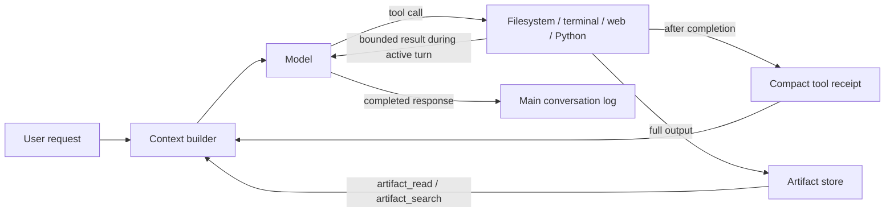

# ContextSift Agent

ContextSift is an experimental local-first agent runtime that keeps the complete main conversation while moving completed tool calls and large results out of routine model context.

> **Project status: proof of concept / alpha.** The core tool-history lifecycle is implemented and tested. ContextSift is not a production sandbox, does not yet enforce its configured token ceiling, and does not yet update durable memory or task state automatically.

## Why ContextSift exists

An active tool loop must show the model the tool call and its result. Many implementations keep those messages in one growing transcript after the turn finishes, so every later request resends already-consumed terminal logs, file contents, search results, and code output.

ContextSift changes the lifecycle after a tool exchange completes:

- Keep every main user request and completed assistant response by default.
- Keep the unfinished tool sequence while the model is using it.
- Replace completed tool exchanges with compact receipts.
- Store full outputs as local artifacts.
- Let the model retrieve exact artifact evidence when it becomes relevant again.

Removing a tool result from active context does not delete it.



See [the architecture notes](docs/ARCHITECTURE.md) for the request lifecycle and storage boundaries.

## Measured result

The reference benchmark held the main history constant in both arms: 40 main messages and the same model, prompts, tools, and tasks. The baseline also retained 20 completed tool calls and 20 raw tool results. ContextSift replaced them with receipts and artifacts.

| Arm | Provider-reported prompt tokens | Task success | Wall time |
|---|---:|---:|---:|
| Full-history tool baseline | 222,274 | 5/5 | 22.05s |
| ContextSift | 25,015 | 5/5 | 12.66s |

That is **88.7% fewer prompt tokens on this synthetic, tool-heavy workload**. It is not a universal reduction claim. The latency figure comes from one run and is not yet statistically stable. Ollama did not report cached prompt tokens, so the benchmark does not claim an equivalent provider-cost reduction.


- [Reference benchmark report](benchmarks/reference/REPORT.md)
- [Sanitized reference metrics](benchmarks/reference/results.json)
- [Fixed benchmark methodology](benchmarks/TEST_PLAN.md)
- [Medium article draft](MEDIUM_ARTICLE_DRAFT.md)

## What is implemented

| Capability | Status | Notes |
|---|---|---|
| All-main-message mode | Implemented and tested | `recent_main_messages = 0`, the default |
| Optional last-N main-message mode | Implemented and tested | Tool protocol messages do not consume the count |
| Completed tool externalization | Implemented and tested | Only main user/completed assistant messages enter conversation history |
| Compact tool ledger | Implemented and tested | Configurable receipt count; `0` includes every receipt |
| Artifact storage and bounded retrieval | Implemented and tested | Exact byte-range reads and text search |
| Filesystem tools | Implemented and tested | Confined to configured workspace roots |
| Terminal tool | Implemented as a POC | No shell; small destructive-command denylist, not a security boundary |
| Python execution | Implemented as a POC | Child process with sanitized environment, not OS-level isolation |
| Tavily search | Implemented | Requires `TAVILY_API_KEY`; live test completed |
| SQLite FTS5 history search | Implemented and tested | Lexical retrieval, not semantic retrieval |
| Context manifests | Implemented and tested | Estimates input and reports `over_budget` |
| Hard token-budget enforcement | **Not implemented** | The agent reports overflow but does not trim or reject requests |
| Automatic `memory.md` updates | **Not implemented** | File is loaded as prompt context only |
| Automatic `state.md` checkpoints | **Not implemented** | File is loaded as prompt context only |
| Duplicate tool-call prevention | **Not implemented** | The ledger helps the model avoid repeats but no deterministic blocker exists |
| Progressive tool-schema disclosure | **Not implemented** | All registered schemas are sent on every request |
| Hardened execution sandbox | **Not implemented** | Use only in a disposable, trusted workspace |

The [roadmap](ROADMAP.md) separates validated behavior from proposed work. The larger [POC specification](CONTEXTSIFT_AGENT_SPEC.md) is a design target and includes features beyond the current implementation.

## Requirements

- Python 3.11 or newer
- Ollama 0.32 or a compatible release
- Access to the configured model; the default is `glm-5.2:cloud`
- Optional Tavily API key for `web_search`

The default provider is Ollama's OpenAI-compatible endpoint at `http://127.0.0.1:11434/v1`. Ollama cloud models may require signing in to Ollama.

## Install

```bash
# From a clone of this repository:
cd contextsift-agent
python3 -m venv .venv
.venv/bin/python -m pip install -e .
```

For Tavily HTTPS support with a portable CA bundle:

```bash
.venv/bin/python -m pip install -e ".[web]"
```

ContextSift otherwise has no third-party runtime dependency. When `certifi` is installed, Tavily uses its CA bundle; otherwise it uses the system certificate store.

Install or verify the default model:

```bash
ollama pull glm-5.2:cloud
ollama list
```

## Quick start

Check configuration without making a model request:

```bash
csift doctor
```

Run one request:

```bash
csift run "Use the filesystem tool to list the project root, then summarize it."
```

Start an interactive session:

```bash
csift chat
```

Without installing the package:

```bash
PYTHONPATH=src python3 -m contextsift_agent doctor
PYTHONPATH=src python3 -m contextsift_agent chat
```

## Configuration

The checked-in [config.toml](config.toml) defaults to all main messages:

```toml
[agent]
model = "glm-5.2:cloud"
base_url = "http://127.0.0.1:11434/v1"
api_key_env = ""
api_key_required = false

[context]
recent_main_messages = 0
max_input_tokens = 32000
tool_ledger_entries = 20
```

`recent_main_messages` counts only main user messages and completed assistant responses:

- `0`: include all main messages.
- Positive integer: include only that many newest main messages.

The CLI can override it without changing the file:

```bash
csift --recent-messages 0 context
csift --recent-messages 10 chat
```

`max_input_tokens` currently powers observability only. A manifest marks `over_budget = true`; the POC does not yet enforce the limit.

For Tavily:

```bash
export TAVILY_API_KEY="..."
```

Never commit API keys or place them in prompt files.

## Included tools

- `filesystem_list_directory`
- `filesystem_stat`
- `filesystem_read_file`
- `filesystem_search_text`
- `filesystem_write_file`
- `terminal_run`
- `web_search`
- `code_execute_python`
- `artifact_read`
- `artifact_search`

Large outputs are bounded before returning to the model and preserved under the local artifact store when truncated.

## Local runtime data

Runtime files are created under `data/` and are ignored by Git:

```text
data/
├── conversation.jsonl
├── tool_calls.jsonl
├── artifacts.jsonl
├── context_manifests.jsonl
├── search.sqlite
├── artifacts/
└── executions/
```

Conversation logs and tool artifacts can contain sensitive user or workspace data. Review them before sharing. Generated benchmark runs under `benchmarks/results/` are also ignored because they may contain absolute paths and raw model/tool output.

## Tests

The offline suite does not call Ollama or Tavily:

```bash
PYTHONDONTWRITEBYTECODE=1 PYTHONPATH=src python3 -m unittest discover -s tests -v
```

The current suite covers context selection, tool externalization, artifact retrieval, provider serialization, filesystem containment, terminal output spilling, and Python secret-environment isolation.

## Reproduce the live benchmark

This calls `glm-5.2:cloud` through Ollama and may consume provider quota:

```bash
PYTHONPATH=src python3 benchmarks/run_tool_history_benchmark.py
python3 benchmarks/render_tool_history_results.py benchmarks/results/<run-id>/results.json
```

Each run creates a timestamped ignored directory. Compare your result with the checked-in [reference report](benchmarks/reference/REPORT.md), but expect model and infrastructure variance.

## Security

ContextSift is not a hardened security boundary.

- Run it only against a workspace you are willing for the agent to read and modify.
- Do not expose the local service to untrusted users.
- Do not rely on the terminal denylist to stop every destructive command.
- Do not rely on Python isolated mode to provide network, filesystem, memory, or kernel isolation.
- Use a container or virtual machine when evaluating untrusted prompts or code.

Read [SECURITY.md](SECURITY.md) before enabling execution tools.

## Contributing

Reproducible bug reports, real trace evaluations, alternative provider adapters, receipt-quality improvements, and safer execution designs are welcome. See [CONTRIBUTING.md](CONTRIBUTING.md).

## License

MIT. See [LICENSE](LICENSE).
